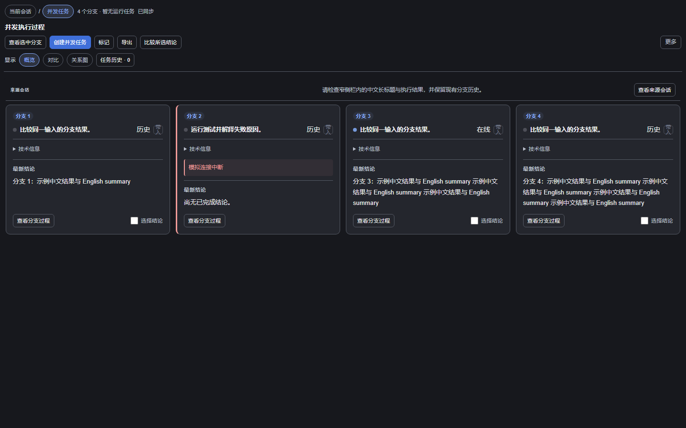

# Flowglass（流镜 · `dsh-flowglass`）

> DeepSeek Harness 的实时会话流程图插件：把用户、助手、工具调用、并行任务和子代理绘制成可钻取的执行流。



Flowglass 是本仓库的默认产品和默认构建目标，当前版本 `0.6.1`。它是原生静态 Host/Client 插件，不使用 `dynamicCordisRunner`，也不产生 `dyn/*`。

工作区已实现 UX 改造，尚未安装到用户实例或发布新版本。上图来自真实源码与脱敏 fixture。源码能力、验证范围和仍待完成的真实宿主验收见 [实施记录](docs/flowglass-ux-implementation.md)；离线测试与性能基线见 [基线记录](docs/flowglass-ux-baseline.md)。下面折叠区的既有产品截图来自改造前版本。

<details>
<summary>改造前界面预览（1920×1080）</summary>

### 流镜


### 并发任务旧版界面（原“大流镜”）


### 插件详情设置


</details>

## 安装

要求 DeepSeek Harness `0.1.5-rc.1` 或更高；推荐使用 `0.1.6-alpha.2` 及以上版本。

### 方式一：Harness 插件管理器（推荐）

打开 Harness Web 侧栏的「插件」→「添加插件」，输入以下任一项：

| 输入 | 示例 |
| --- | --- |
| npm 包名 | `dsh-flowglass@0.6.1` |
| GitHub 仓库地址 | `https://github.com/Iwctwbh/dsh-flowglass` |
| 本地插件目录 | `C:\work\dsh-flowglass` |
| 本地 tarball | `C:\work\dsh-flowglass-0.6.1.tgz` |

点击「安装」，安装完成后选择「启用」。插件管理器会先读取包的名称、版本和说明，再执行安装；本地插件代码会以当前用户权限运行，请只安装可信来源。

### 方式二：命令行

```powershell
# npm，推荐固定版本
dsh plugin --profile web add dsh-flowglass@0.6.1

# GitHub，建议固定 tag 或 commit
dsh plugin --profile web add github:Iwctwbh/dsh-flowglass#v0.6.1

# 本地目录或 tarball
dsh plugin --profile web add C:\work\dsh-flowglass
dsh plugin --profile web add C:\work\dsh-flowglass-0.6.1.tgz
```

升级或卸载：

```powershell
dsh plugin --profile web add dsh-flowglass@0.6.1
dsh plugin --profile web remove dsh-flowglass
```

安装后重启 Harness；如已安装 `dsh-better-sidebar`，它会作为原生右侧栏不可用时的兼容后备，不是 Flowglass 的必需依赖。

## 能力概览

### 当前会话

- 按容器宽度切换纵向时间流与宽栏泳道；用户、助手、工具和子代理都有清楚的层次。
- 实时显示助手生成、工具调用、并行分组和子代理分支。
- 点击或键盘激活消息 / 工具查看详情；输出优先，系统上下文、输入参数和技术信息按需展开。
- 支持子代理逐层钻取、面包屑返回、分支续跑和 Harness Session 联动。
- 默认使用 Harness 官方 Markdown renderer；页面不可见时暂停刷新，返回后继续。
- 支持声明式工具显示规则：Git、GitHub CLI、pnpm、npm、DSH、Python 默认随包提供。
- 支持已加载 / 全会话查找、类型和状态筛选、失败关注入口，以及带备注的本地节点标记。
- 只读事件回放不会执行命令；支持预览后下载当前可见节点的 JSON 诊断摘要或 SVG 节点快照，默认不含正文。

### 并发任务

- 概览显示实际分支的状态、当前步骤和最新结论；点击查看分支过程，以面包屑返回。
- 支持 2/3/4 分支、概览 / 对比 / 关系图；旧视图偏好保持兼容。
- 对比基于完整输入证据，缺少同源证据时标注“未对齐”；共享输入只显示一次，可筛选差异。
- 选择 2–4 条已完成结论，预览来源后追加到目标会话草稿，不自动发送。
- 保存拓扑历史和分支轮次，不覆盖旧历史，可表达 `1→2→1→2` 等并发演进。
- 关系图按「会话竖列 × 历史轮次」展示分叉、沿用和跨轮关系；可适应画布、定位选中、恢复布局，并支持键盘操作。
- 支持添加/移除并发成员、从回答节点发起新的 `1→N` 任务。
- 编辑草稿时继续观察刷新；逐分支记录创建、配置、发送结果，未知回执保持未知，恢复时复用已有 Session。

### 官方插件设置

在 Harness 侧栏「插件」中打开 `flowglass` 详情页，可配置：

- 切换 Session 时是否保持流镜展开；
- 是否启用并发任务；
- 默认分支数量；
- 并发任务默认视图；
- 轮询刷新间隔；
- 工具显示规则的启停、编辑、删除和恢复。

设置通过 Harness 官方 `plugins.bundle.config` 扩展点提供，仅保存于当前浏览器，不写入 Git、Session 日志或 npm 包。

## 承载与降级

Flowglass 按以下顺序选择承载面，同一时刻只启用一条路径：

1. Harness 原生右侧栏（DSH 0.1.5+）；
2. `dsh-better-sidebar >=0.19.0` 的原生桥；
3. Flowglass 自带的固定右侧兜底面板。

无需手动选择承载方式，插件会自动适配当前 Harness 能力。

## 本地开发与验证

### 构建静态 Flowglass

```powershell
node make-payloads.mjs
node scripts/build-toolbox-bundle.mjs --flow --version 0.6.1 --clean
node scripts/verify-generated.mjs
node scripts/verify-bundle.mjs dist/toolbox-bundles/flow --pack
node smoke.mjs
```

构建产物位于 `dist/toolbox-bundles/flow/`；如需回填仓库内的默认产品目录：

```powershell
Copy-Item dist/toolbox-bundles/flow/* flowglass/ -Recurse -Force
```

### 最新 Harness 联调

在最新 Harness 源码 checkout 中：

```powershell
pnpm install --frozen-lockfile
pnpm run build
pnpm dsh web --no-open --port 3080
```

另开终端构建并安装本地 Flowglass：

```powershell
node scripts/build-toolbox-bundle.mjs --flow --version 0.6.1 --clean
node scripts/verify-bundle.mjs dist/toolbox-bundles/flow --pack
Push-Location dist/toolbox-bundles/flow
$flowglassPackage = npm pack
Pop-Location
dsh plugin --profile web add <flowglassPackage>
```

截图验收应覆盖 360 / 480 / 720 / 960px 侧栏与宽屏，分别检查当前会话、并发任务、详情和「插件 → flowglass」设置页。已运行的离线门禁及真实宿主验收限制见 [基线记录](docs/flowglass-ux-baseline.md)。不要为了联调替换正在使用的 3080 实例；新增测试实例使用独立 profile 与端口。

## 动态 Toolbox（可选）

本仓库也提供独立的完整工具箱 `dsh-dynamic-toolbox`，包含 Jira、Git、文件、HTTP、AI 助手等工具。它不是 Flowglass 的运行前置：

```powershell
dsh plugin --profile web add dsh-dynamic-toolbox
```

相关文档：[`dynamic-toolbox/README.md`](dynamic-toolbox/README.md)、[`REBUILD.md`](REBUILD.md)、[`PLUGIN-DEV.md`](PLUGIN-DEV.md)。

Flowglass 和 Toolbox 共用部分源码。此次增强保留普通工具的 `{html,state}` 和 `data-action/data-field` 协议；Flow 样式按根节点限定，`flowedit` 继续使用原有基础样式。独立 Flowglass、完整静态 Toolbox、源码动态 Toolbox 的能力与验证矩阵见 [实施记录](docs/flowglass-ux-implementation.md#toolbox-三形态能力矩阵)。

## License

[MIT](LICENSE) © 2026 Iwctwbh
